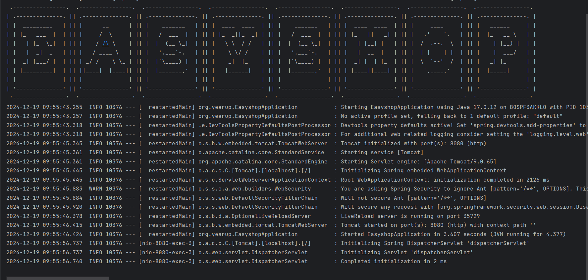
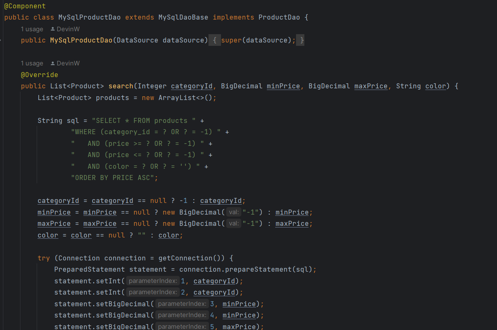
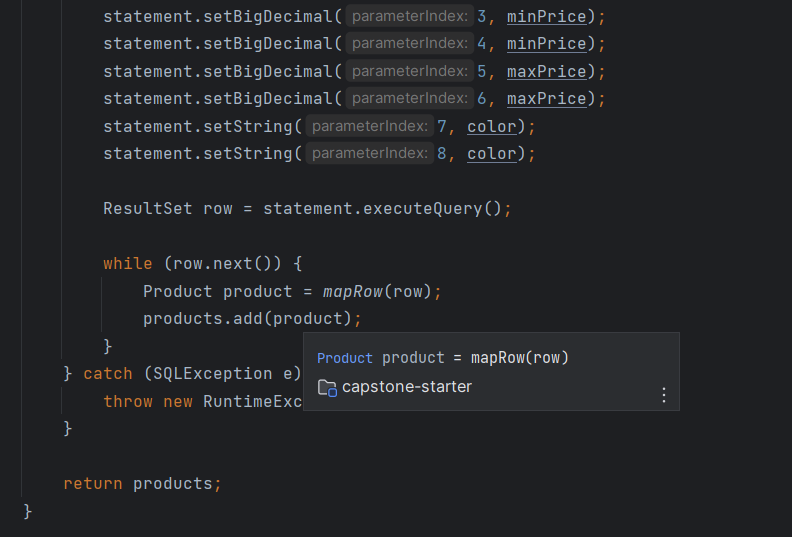
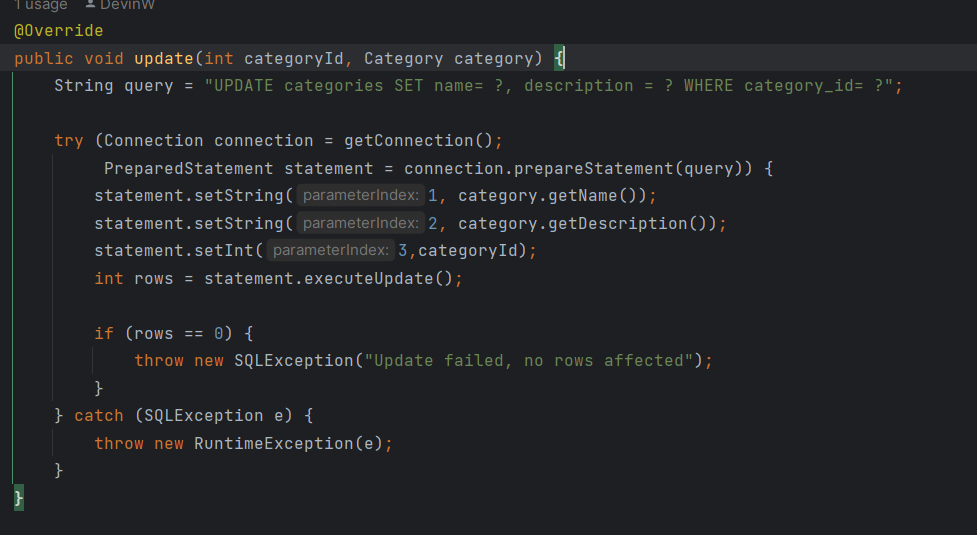
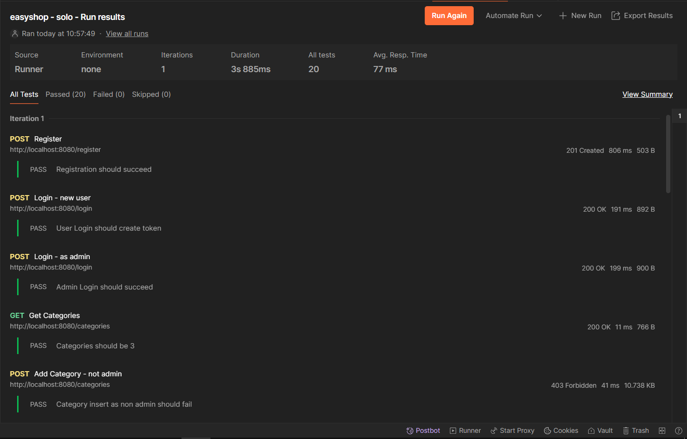
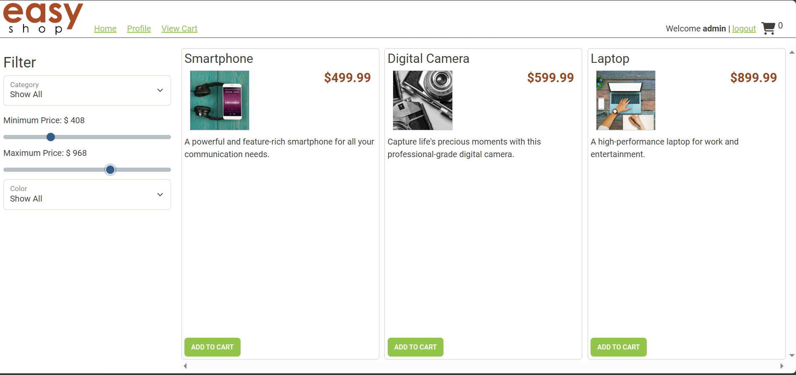

# Ez SHOP

## Description of the Project

As an application developer, my role extends beyond writing my own code to include improving and optimizing preexisting code. Within this application, I enhanced existing code to improve its functionality and resolved bugs that impeded performance. This effort culminated in delivering a fully functional API and a robust front-end store, ensuring seamless integration and a better user experience. 

## User Stories
- As a user I would like to be able to get all categories.
- As the ADMIN I would like to be able to delete categories.
- As the user I would like to be able to get category by id.
- As the user I would like to be able to get all products.
- As the Amin I would like to be able to insert products into the database.
- As the admin I would like to be able to delete products from the database.
- As the admin I would like to update products.
- As the user I would like to be able to get products by Id.
- As the ADMIN I would like to be able to update categories.
- As the ADMIN I would like to be able to add a category into the database.
- As the user I would like to be able to run the API without having any bug.

## Setup

- Run Capstone starter
- Refresh database in SQL
- Run Web application

### Prerequisites

- IntelliJ IDEA: Ensure you have IntelliJ IDEA installed, which you can download from [here](https://www.jetbrains.com/idea/download/).
- Java SDK: Make sure Java SDK is installed and configured in IntelliJ.

### Running the Application in IntelliJ

Follow these steps to get your application running within IntelliJ IDEA:

1. Open IntelliJ IDEA.
2. Select "Open" and navigate to the directory where you cloned or downloaded the project.
3. After the project opens, wait for IntelliJ to index the files and set up the project.
4. Find the main class with the `public static void main(String[] args)` method.
5. Right-click on the file and select 'Run 'YourMainClassName.main()'' to start the application.

## Technologies Used

- Spring Boot
- Intellij 
- SQL Workbench
- 
## Demo
Running application

Product filter (bug 1)

Create/Delete category

All test are Passing 

Example of filtration on web application 

## Future Work

- additional improvement to front end code. 

## Resources

List resources such as tutorials, articles, or documentation that helped you during the project.

- https://github.com/RayMaroun
- Google

## Team Members

- **Brandon** - Continues support and guidance
- **Cameron** - Helping with code issue.

## Thanks

- Thank you to Raymond for continuous support and guidance. I really enjoyed the 12 weeks I got to learn from you!  
